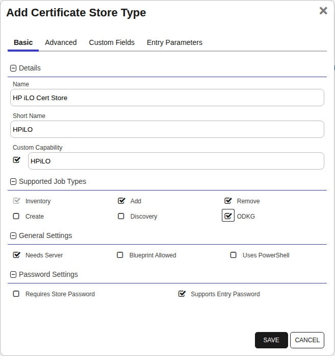
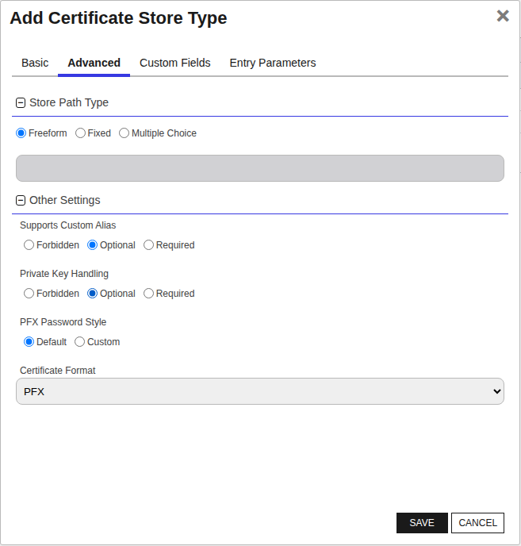
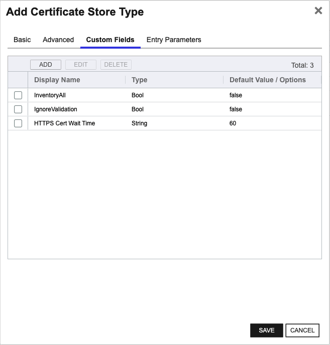
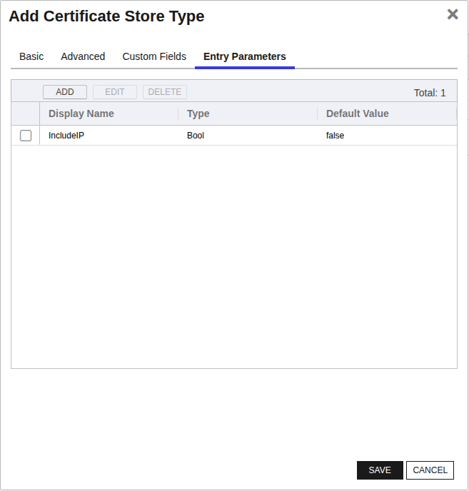

<h1 align="center" style="border-bottom: none">
    HP iLO Universal Orchestrator Extension
</h1>

<p align="center">
  <!-- Badges -->

<a href="https://github.com/Keyfactor/hp-ilo-orchestrator-dev/releases"></a>


</p>

<p align="center">
  <!-- TOC -->
  <a href="#support">
    <b>Support</b>
  </a>
  ·
  <a href="#installation">
    <b>Installation</b>
  </a>
  ·
  <a href="#license">
    <b>License</b>
  </a>
  ·
  <a href="https://github.com/orgs/Keyfactor/repositories?q=orchestrator">
    <b>Related Integrations</b>
  </a>
</p>

## Overview

This is an HP iLO orchestrator extension.
### ⚠️ Important Notice
**Cert Store Type has been changed from version 1.0. Please update existing stores to include the new entry parameter, enable Add job functionality and make sure the default values for custom fields and entry paremeters align, then run an inventory job afterwards. Please see Changelog for the full list of many changes. See store type documentation below for reference.**


## Compatibility

This integration is compatible with Keyfactor Universal Orchestrator version 25.2 and later.

## Support
The HP iLO Universal Orchestrator extension If you have a support issue, please open a support ticket by either contacting your Keyfactor representative or via the Keyfactor Support Portal at https://support.keyfactor.com.

> To report a problem or suggest a new feature, use the **[Issues](../../issues)** tab. If you want to contribute actual bug fixes or proposed enhancements, use the **[Pull requests](../../pulls)** tab.

## Requirements & Prerequisites

Before installing the HP iLO Universal Orchestrator extension, we recommend that you install [kfutil](https://github.com/Keyfactor/kfutil). Kfutil is a command-line tool that simplifies the process of creating store types, installing extensions, and instantiating certificate stores in Keyfactor Command.


- **Target Platform:** HP iLO 6  
- **Tested HPiLO Firmware Versions:** 1.58 and 1.69


## HPiLO Certificate Store Type

To use the HP iLO Universal Orchestrator extension, you **must** create the HPiLO Certificate Store Type. This only needs to happen _once_ per Keyfactor Command instance.


This document details supported certificate operations for HP iLO.  

`IncludeIP` entry parameter should be set to false outside of HTTPSCert reenrollment/ODKG operation.

`CertType` entry parameter is required for all operations and should be set to the type of certificate the operation is carried out on.

Please review the description of each supported operation below to understand the requirements and limitations.


#### Supported Operations

| Operation    | Is Supported                                                                                                           |
|--------------|------------------------------------------------------------------------------------------------------------------------|
| Add          | ✅ Checked        |
| Remove       | ✅ Checked     |
| Discovery    | 🔲 Unchecked  |
| Reenrollment | ✅ Checked |
| Create       | 🔲 Unchecked     |

#### Store Type Creation

##### Using kfutil:
`kfutil` is a custom CLI for the Keyfactor Command API and can be used to create certificate store types.
For more information on [kfutil](https://github.com/Keyfactor/kfutil) check out the [docs](https://github.com/Keyfactor/kfutil?tab=readme-ov-file#quickstart)
   <details><summary>Click to expand HPiLO kfutil details</summary>

   ##### Using online definition from GitHub:
   This will reach out to GitHub and pull the latest store-type definition
   ```shell
   # HP iLO Cert Store
   kfutil store-types create HPiLO
   ```

   ##### Offline creation using integration-manifest file:
   If required, it is possible to create store types from the [integration-manifest.json](./integration-manifest.json) included in this repo.
   You would first download the [integration-manifest.json](./integration-manifest.json) and then run the following command
   in your offline environment.
   ```shell
   kfutil store-types create --from-file integration-manifest.json
   ```
   </details>


#### Manual Creation
Below are instructions on how to create the HPiLO store type manually in
the Keyfactor Command Portal
   <details><summary>Click to expand manual HPiLO details</summary>

   Create a store type called `HPiLO` with the attributes in the tables below:

   ##### Basic Tab
   | Attribute | Value | Description |
   | --------- | ----- | ----- |
   | Name | HP iLO Cert Store | Display name for the store type (may be customized) |
   | Short Name | HPiLO | Short display name for the store type |
   | Capability | HPiLO | Store type name orchestrator will register with. Check the box to allow entry of value |
   | Supports Add | ✅ Checked | Check the box. Indicates that the Store Type supports Management Add |
   | Supports Remove | ✅ Checked | Check the box. Indicates that the Store Type supports Management Remove |
   | Supports Discovery | 🔲 Unchecked |  Indicates that the Store Type supports Discovery |
   | Supports Reenrollment | ✅ Checked |  Indicates that the Store Type supports Reenrollment |
   | Supports Create | 🔲 Unchecked |  Indicates that the Store Type supports store creation |
   | Needs Server | ✅ Checked | Determines if a target server name is required when creating store |
   | Blueprint Allowed | 🔲 Unchecked | Determines if store type may be included in an Orchestrator blueprint |
   | Uses PowerShell | 🔲 Unchecked | Determines if underlying implementation is PowerShell |
   | Requires Store Password | 🔲 Unchecked | Enables users to optionally specify a store password when defining a Certificate Store. |
   | Supports Entry Password | ✅ Checked | Determines if an individual entry within a store can have a password. |

   The Basic tab should look like this:

   

   ##### Advanced Tab
   | Attribute | Value | Description |
   | --------- | ----- | ----- |
   | Supports Custom Alias | Forbidden | Determines if an individual entry within a store can have a custom Alias. |
   | Private Key Handling | Optional | This determines if Keyfactor can send the private key associated with a certificate to the store. Required because IIS certificates without private keys would be invalid. |
   | PFX Password Style | Default | 'Default' - PFX password is randomly generated, 'Custom' - PFX password may be specified when the enrollment job is created (Requires the Allow Custom Password application setting to be enabled.) |

   The Advanced tab should look like this:

   

   > For Keyfactor **Command versions 24.4 and later**, a Certificate Format dropdown is available with PFX and PEM options. Ensure that **PFX** is selected, as this determines the format of new and renewed certificates sent to the Orchestrator during a Management job. Currently, all Keyfactor-supported Orchestrator extensions support only PFX.

   ##### Custom Fields Tab
   Custom fields operate at the certificate store level and are used to control how the orchestrator connects to the remote target server containing the certificate store to be managed. The following custom fields should be added to the store type:

   | Name | Display Name | Description | Type | Default Value/Options | Required |
   | ---- | ------------ | ---- | --------------------- | -------- | ----------- |
   | InventoryAll | InventoryAll | If true, allows for inventory of additional factory-installed certificates and their chains: `Platform Cert`,`SystemIAK`,`SystemIDevID`, `iLOIDevID/BMCIDevIDPCA` | Bool | false | ✅ Checked |
   | IgnoreValidation | IgnoreValidation | WARNING: Only enable if testing. Used to disable certificate validation checks at the API endpoint. Should be set to false in any production scenario. | Bool | false | ✅ Checked |
   | HTTPSCertWaitTime | HTTPS Cert Wait Time | The HPiLO API requires the user to wait while the HTTPS Cert CSR is generated. HP suggests a time of 60 seconds, as is the default setting, but it can be adjusted. | String | 60 | ✅ Checked |

   The Custom Fields tab should look like this:

   

   ##### Entry Parameters Tab

   | Name | Display Name | Description | Type | Default Value | Entry has a private key | Adding an entry | Removing an entry | Reenrolling an entry |
   | ---- | ------------ | ---- | ------------- | ----------------------- | ---------------- | ----------------- | ------------------- | ----------- |
   | IncludeIP | IncludeIP | Enables the addition of the device IP as a SAN to the CSR during reenrollment. Used particularly during HTTPSCert reenrollment, where it can be set as desired, and should be set to false during all other operations. | Bool | false | 🔲 Unchecked | 🔲 Unchecked | 🔲 Unchecked | ✅ Checked |
   | CertificateType | CertificateType | Specifies the type of device certificate for reenrollment and storage. Must be set manually for deletion and reenrollment. | MultipleChoice |  | 🔲 Unchecked | ✅ Checked | ✅ Checked | ✅ Checked |

   The Entry Parameters tab should look like this:

   

   </details>

## Installation

1. **Download the latest HP iLO Universal Orchestrator extension from GitHub.**

    Navigate to the [HP iLO Universal Orchestrator extension GitHub version page](https://github.com/Keyfactor/hp-ilo-orchestrator-dev/releases/latest). Refer to the compatibility matrix below to determine whether the `net6.0` or `net8.0` asset should be downloaded. Then, click the corresponding asset to download the zip archive.

   | Universal Orchestrator Version | Latest .NET version installed on the Universal Orchestrator server | `rollForward` condition in `Orchestrator.runtimeconfig.json` | `hp-ilo-orchestrator-dev` .NET version to download |
   | --------- | ----------- | ----------- | ----------- |
   | Older than `11.0.0` | | | `net6.0` |
   | Between `11.0.0` and `11.5.1` (inclusive) | `net6.0` | | `net6.0` |
   | Between `11.0.0` and `11.5.1` (inclusive) | `net8.0` | `Disable` | `net6.0` |
   | Between `11.0.0` and `11.5.1` (inclusive) | `net8.0` | `LatestMajor` | `net8.0` |
   | `11.6` _and_ newer | `net8.0` | | `net8.0` |

    Unzip the archive containing extension assemblies to a known location.

    > **Note** If you don't see an asset with a corresponding .NET version, you should always assume that it was compiled for `net6.0`.

2. **Locate the Universal Orchestrator extensions directory.**

    * **Default on Windows** - `C:\Program Files\Keyfactor\Keyfactor Orchestrator\extensions`
    * **Default on Linux** - `/opt/keyfactor/orchestrator/extensions`

3. **Create a new directory for the HP iLO Universal Orchestrator extension inside the extensions directory.**

    Create a new directory called `hp-ilo-orchestrator-dev`.
    > The directory name does not need to match any names used elsewhere; it just has to be unique within the extensions directory.

4. **Copy the contents of the downloaded and unzipped assemblies from __step 2__ to the `hp-ilo-orchestrator-dev` directory.**

5. **Restart the Universal Orchestrator service.**

    Refer to [Starting/Restarting the Universal Orchestrator service](https://software.keyfactor.com/Core-OnPrem/Current/Content/InstallingAgents/NetCoreOrchestrator/StarttheService.htm).


6. **(optional) PAM Integration**

    The HP iLO Universal Orchestrator extension is compatible with all supported Keyfactor PAM extensions to resolve PAM-eligible secrets. PAM extensions running on Universal Orchestrators enable secure retrieval of secrets from a connected PAM provider.

    To configure a PAM provider, [reference the Keyfactor Integration Catalog](https://keyfactor.github.io/integrations-catalog/content/pam) to select an extension and follow the associated instructions to install it on the Universal Orchestrator (remote).


> The above installation steps can be supplemented by the [official Command documentation](https://software.keyfactor.com/Core-OnPrem/Current/Content/InstallingAgents/NetCoreOrchestrator/CustomExtensions.htm?Highlight=extensions).


## Defining Certificate Stores


### Store Creation

#### Manually with the Command UI

<details><summary>Click to expand details</summary>

1. **Navigate to the _Certificate Stores_ page in Keyfactor Command.**

    Log into Keyfactor Command, toggle the _Locations_ dropdown, and click _Certificate Stores_.

2. **Add a Certificate Store.**

    Click the Add button to add a new Certificate Store. Use the table below to populate the **Attributes** in the **Add** form.

   | Attribute | Description                                             |
   | --------- |---------------------------------------------------------|
   | Category | Select "HP iLO Cert Store" or the customized certificate store name from the previous step. |
   | Container | Optional container to associate certificate store with. |
   | Client Machine | Should contain a copy of the store path for compatibility reasons but is currently unused. |
   | Store Path | This should contain the path pointsing to the HPiLO instance address, IP or domain name. |
   | Store Password | Password to use when reading/writing to store |
   | Orchestrator | Select an approved orchestrator capable of managing `HPiLO` certificates. Specifically, one with the `HPiLO` capability. |
   | InventoryAll | If true, allows for inventory of additional factory-installed certificates and their chains: `Platform Cert`,`SystemIAK`,`SystemIDevID`, `iLOIDevID/BMCIDevIDPCA` |
   | IgnoreValidation | WARNING: Only enable if testing. Used to disable certificate validation checks at the API endpoint. Should be set to false in any production scenario. |
   | HTTPSCertWaitTime | The HPiLO API requires the user to wait while the HTTPS Cert CSR is generated. HP suggests a time of 60 seconds, as is the default setting, but it can be adjusted. |

</details>


#### Using kfutil CLI

<details><summary>Click to expand details</summary>

1. **Generate a CSV template for the HPiLO certificate store**

    ```shell
    kfutil stores import generate-template --store-type-name HPiLO --outpath HPiLO.csv
    ```
2. **Populate the generated CSV file**

    Open the CSV file, and reference the table below to populate parameters for each **Attribute**.

   | Attribute | Description |
   | --------- | ----------- |
   | Category | Select "HP iLO Cert Store" or the customized certificate store name from the previous step. |
   | Container | Optional container to associate certificate store with. |
   | Client Machine | Should contain a copy of the store path for compatibility reasons but is currently unused. |
   | Store Path | This should contain the path pointsing to the HPiLO instance address, IP or domain name. |
   | Store Password | Password to use when reading/writing to store |
   | Orchestrator | Select an approved orchestrator capable of managing `HPiLO` certificates. Specifically, one with the `HPiLO` capability. |
   | Properties.InventoryAll | If true, allows for inventory of additional factory-installed certificates and their chains: `Platform Cert`,`SystemIAK`,`SystemIDevID`, `iLOIDevID/BMCIDevIDPCA` |
   | Properties.IgnoreValidation | WARNING: Only enable if testing. Used to disable certificate validation checks at the API endpoint. Should be set to false in any production scenario. |
   | Properties.HTTPSCertWaitTime | The HPiLO API requires the user to wait while the HTTPS Cert CSR is generated. HP suggests a time of 60 seconds, as is the default setting, but it can be adjusted. |

3. **Import the CSV file to create the certificate stores**

    ```shell
    kfutil stores import csv --store-type-name HPiLO --file HPiLO.csv
    ```

</details>


#### PAM Provider Eligible Fields
<details><summary>Attributes eligible for retrieval by a PAM Provider on the Universal Orchestrator</summary>

If a PAM provider was installed _on the Universal Orchestrator_ in the [Installation](#Installation) section, the following parameters can be configured for retrieval _on the Universal Orchestrator_.

   | Attribute | Description |
   | --------- | ----------- |
   | ServerUsername | Username to use when connecting to server |
   | ServerPassword | Password to use when connecting to server |
   | StorePassword | Password to use when reading/writing to store |

Please refer to the **Universal Orchestrator (remote)** usage section ([PAM providers on the Keyfactor Integration Catalog](https://keyfactor.github.io/integrations-catalog/content/pam)) for your selected PAM provider for instructions on how to load attributes orchestrator-side.
> Any secret can be rendered by a PAM provider _installed on the Keyfactor Command server_. The above parameters are specific to attributes that can be fetched by an installed PAM provider running on the Universal Orchestrator server itself.

</details>


> The content in this section can be supplemented by the [official Command documentation](https://software.keyfactor.com/Core-OnPrem/Current/Content/ReferenceGuide/Certificate%20Stores.htm?Highlight=certificate%20store).


### Inventory
The following certificates can be inventoried:
- **HTTPS Certificate**
    
    The TLS certificate used for connections to this iLO instance.
	> **Note:** Only the HTTPS certificate used for iLO system/API connection via TLS can be inventoried, due to HP iLO API limitations.

- **iLOLDevID**

  Certificate used for 802.1X authentication. 

- **Additional Factory‑Installed Certificates**			  
    *(Require `InventoryAll = True` in Certificate Store Type)*
	- Platform Cert  
	- SystemIAK  
	- SystemIDevID  
	- iLOIDevID / BMCIDevIDPCA

### Management Add (Addition to certificate store)
The following certificate supports addition to an HPiLO cert store:
- **HTTPS Certificate:**
    				
	Performing this operation will import a specified PFX certificate and store the certificate and its private key in HPiLO. Only PFX certificates can be added. After the operation is complete, HPiLO will reboot.
    HP iLO will take in a cert with an RSA 2084 based key, similarly to HTTPS Cert reenrollment/ODKG.
	- **Alias:** `HTTPSCert`
	- **Overwrite:** `Yes`
		- Overwrite needs to be enabled.
	- **IncludeIP:** `False`

### Management Remove (Removal from certificate store)
The following certificates can be deleted from an HPiLO cert store:
- **HTTPS Certificate**
	- **IncludeIP:** `false`
- **iLOLDevID (802.1X Certificate)** 
	- **IncludeIP:** `false`

### Reenrollment / ODKG
The following certificates can be undergo reenrollment/ODKG using an HPiLO cert store:
- **HTTPS Certificate**  
  Following the reenrollment of an HTTPS certificate, HP iLO will reboot. The CSR produced by HP iLO for this purpose will utilize a RSA 2084 key. Please ensure your CA supports this algorithm and has an appropriate template configured.
	- **Alias:** `HTTPSCert`  
	- **Subject String Format:**  
	  ```text
	  CN=test.demo.local, L=Example, ST=Example, C=Example, OU=Example, O=Example
	  ```  
	  - Supported attributes: `CN`, `O`, `OU`, `L`, `ST`, `C`.  
	  - The `CN` must match the iLO FQDN.
	  - **Note:** iLO will reboot after the certificate is installed. 
	- **IncludeIP** If set to true, iLO will automatically add its IPv4/IPv6 addresses as SANs. The CN is added as a SAN automatically.  
- **iLOLDevID**  
  802.1X Certificate reenrollment. The CSR produced by HPiLO will utilize ECC 384 based key. Please setup an appropriate template and make sure your CA supports this algorithm. 
	- **Alias:** `1/iLOLDevID` 
	- **IncludeIP** `false`
	- **Subject String Format:**  
	The subject string contents depend on the version of HP iLO firmware you are using.
		##### Versions Below HPiLO 6 1.60 
		```text
		CN=CZJ3199GDZ, O=Hewlett Packard Enterprise, OU=Servers, L=Houston, ST=TX, C=US
		```
		- `CN` must match the iLO serial number, e.g. CZJ3199GDZ 
		- Other attributes must match exactly for Keyfactor to correlate the CSR and resulting certificate. 
		##### Versions HPiLO 6 1.60 and Above
		```text
		CN=P98765-B21, SURNAME=PYNXHC2ZGIE11U, GIVENNAME=P12345-001, SERIALNUMBER=CZJ3199GDZ, OU=Servers, O=Hewlett Packard Enterprise Development, L=Houston, ST=Texas, C=US
		```
		- For complete details on the contents of these attributes, please see the [HP iLO LDevID CSR documentation](https://servermanagementportal.ext.hpe.com/docs/redfishservices/ilos/supplementdocuments/securityservice/#ilo-ldevid-csr-format). There is a chart explaining the contents of these fields and their required values.

> **Manager Limitation:**  
> Reenrollment and deletion are only supported on internal manager 1 (common in typical HP iLO deployments).  
> See the [HP iLO API Reference](https://servermanagementportal.ext.hpe.com/docs/redfishservices/ilos/ilo6/ilo6_158/ilo6_manager_resourcedefns158/#manager) for details.


## License

Apache License 2.0, see [LICENSE](LICENSE).

## Related Integrations

See all [Keyfactor Universal Orchestrator extensions](https://github.com/orgs/Keyfactor/repositories?q=orchestrator).